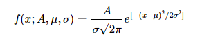

First, let's start with the equation that you are fitting to. This is defined in the lmfit docs:


There is a [sneaky line](
https://lmfit.github.io/lmfit-py/builtin_models.html#:~:text=amplitude%2C%20center%2C%20and%20sigma.%20In%20addition%2C-,parameters%20fwhm%20and%20height%20are%20included%20as%20constraints%20to%20report%20full%20width%20at%20half%20maximum%20and%20maximum%20peak%20height%2C%20respectively.,-f(x%3BA%2C%CE%BC%2C%CF%83)%3DA%CF%832%CF%80e) in here that is easy to miss, and that I think is the source of your confusion:

>Parameters *fwhm* and *height* are included as constraints to report full width at half maximum and maximum peak height, respectively.

So, when you fit your data to the model you can extract *both* the ```height``` and ```amplitude``` parameters despite only the ```amplitude``` being optimised. This is because the two are related - to find out where height comes from, we can dive into the lmfit source code for the [GaussianModel](https://github.com/lmfit/lmfit-py/blob/caf8c8916f7056c151a246cdbb22ac5b33b1d823/lmfit/models.py#:~:text=class%20GaussianModel(Model)%3A), and then from there piece together how [height](https://github.com/lmfit/lmfit-py/blob/caf8c8916f7056c151a246cdbb22ac5b33b1d823/lmfit/models.py#:~:text=def%20height_expr(model)%3A) and amplitude are related. 


Combining these two things together leaves us with 

```python
height_factor = 1. / np.sqrt(2*np.pi) #recipricol of the square root of two pi
height = height_factor * amplitude / sigma
```

and rearranging to solve for amplitude gives

``` python
amplitude = height * sigma / height_factor
```

Now, if that looks vaguely familiar, that's because it is effectively the same as the area formula that you were trying to use!


where, in this case SD=```sigma```.

So - long story short, the *amplitude* parameter that you are fitting using lmfit's gaussian model is in fact the area (composed of the sigma and height, and assuming the baseline is at 0). The reason you were getting strange results with your code is you were using this already-transformed parameter and transforming it *again* using the area formula. In your example, I'm guessing the ```amplitudes``` are quite similar between the two peaks, but the ```sigma``` of the green peak will be HUGE (it's very broad) while the ```sigma``` of the blue peak comparatively smaller. What you end up with is multiplying the area of the green peak by LOTS and the blue peak by not so much - resulting in the apparently large green peak area compared to the blue.

Now, just in case you don't believe me (totally your perogative!) then I ran through an example where I fit some simulated data with python and derived the area by  fitting and integrating, and also compared it with an online calculator by reverse-engineering the fitted gaussian model. You can find and play with the code [here](https://github.com/dezeraecox-utilities/fitting_gaussians)

Here is my simulated data fitted to an lmfit gaussian model:


Remember this is the lmfit eqn for the gaussian model:



And substituting my fitted parameters into the lmfit equation in the [online calculator](https://www.symbolab.com/solver/area-under-curve-calculator/area%20f%5Cleft(x%5Cright)%3D%5Cfrac%7B4.12%7D%7B2.67%5Csqrt%7B2%5Cpi%7D%7De%5E%7B%5Cfrac%7B-%5Cleft(x-15.0%5Cright)%5E2%7D%7B14.2578%7D%7D%2C%20%5Cleft%5B0%2C%2050%5Cright%5D?or=input) to determine the area between 0 and 50 via integration: 


Notice the ```A``` parameter (4.12) is effectively the same as the calculated area (4.119):


And just to confirm it is actually calculating the curve we think it is:


